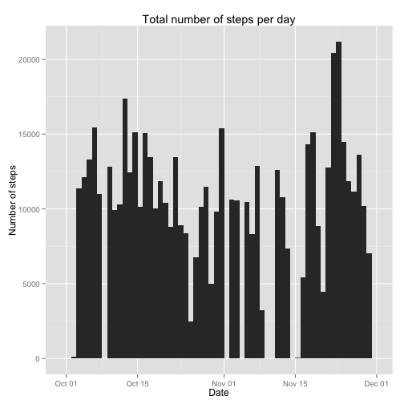
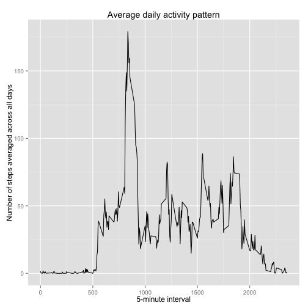
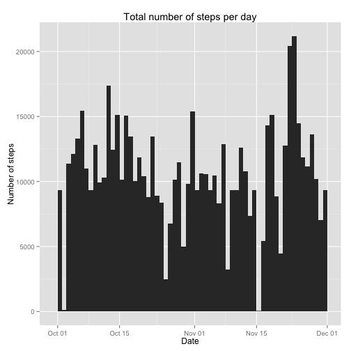

Reproducible Research: Peer assignment 1
========================================================

## Dependencies

```r
library(ggplot2)
library(plyr)
library(timeDate)
library(lattice)
```


## Loading and preprocessing the data

Read in the csv file and convert dates to to the right format.

```r
data <- read.csv("activity.csv")
data$date <- as.Date(as.character(data$date, format = "%Y/%m/%d"))
```


## What is mean total number of steps taken per day?

1. Histogram of the total number of steps taken each day

```r
qplot(data$date, data = data, weight = data$steps, geom = "histogram", binwidth = 1) + 
    xlab("Date") + ylab("Number of steps") + ggtitle("Total number of steps per day")
```

 


2. Transform data using plyr:

```r
data.sum.steps.per.day <- ddply(data, c("date"), function(df) c(sum(df$steps, 
    na.rm = TRUE)))
```


The mean total number of steps taken per day (ignoring missing values) is :

```r
mean(data.sum.steps.per.day$V1, na.rm = TRUE)
```

```
## [1] 9354
```

The median total number of steps taken per day (ingoring missing values) is : 

```r
median(data.sum.steps.per.day$V1, na.rm = TRUE)
```

```
## [1] 10395
```


## What is the average daily activity pattern?

1. Transform data using plyr:

```r
num_days <- length(unique(data$date))
data.avg.steps.per.interval <- ddply(data, c("interval"), function(df) c(sum(df$steps, 
    na.rm = TRUE)/num_days))
```


Plot the time series:

```r
qplot(data.avg.steps.per.interval$interval, data.avg.steps.per.interval$V1, 
    geom = "line") + xlab("5-minute interval") + ylab("Number of steps averaged across all days") + 
    ggtitle("Average daily activity pattern")
```

 


2. The 5 minute interval that contains the maximum number of steps (averaged across all days is):

```r
data.avg.steps.per.interval[which.max(data.avg.steps.per.interval$V1), c("interval")]
```

```
## [1] 835
```


## Imputing missing values

1. The total number of missing values in the dataset is:

```r
length(data[is.na(data$steps), c("steps")])
```

```
## [1] 2304
```


2-3. Impute missing values
Copy the data and for convert each NA to the average number of steps for that interval:

```r
data.impute <- data
na.index <- which(is.na(data.impute$steps))
for (index in na.index) {
    data.impute$steps[index] <- data.avg.steps.per.interval[data.avg.steps.per.interval$interval == 
        data.impute$interval[index], c("V1")]
}
```


4. Histogram of the total number of steps taken each day

```r
qplot(data.impute$date, data = data.impute, weight = data.impute$steps, geom = "histogram", 
    binwidth = 1) + xlab("Date") + ylab("Number of steps") + ggtitle("Total number of steps per day")
```

 


Transform data using plyr:

```r
data.impute.sum.steps.per.day <- ddply(data.impute, c("date"), function(df) c(sum(df$steps)))
```


The mean total number of steps taken per day (ignoring missing values) is :

```r
mean(data.impute.sum.steps.per.day$V1)
```

```
## [1] 10581
```

The median total number of steps taken per day (ingoring missing values) is : 

```r
median(data.impute.sum.steps.per.day$V1)
```

```
## [1] 10395
```


Those estimates are not the same as those computed in the first part of the assignment.
As expected, the total number of steps has increased:
* Total number of steps before: 570608
* Total number of steps after: 6.4544 &times; 10<sup>5</sup>


## Are there differences in activity patterns between weekdays and weekends?

Create a new factor variables for weekdays/weekends and add it to the data frame with the imputed data:

```r
weekdays <- as.factor(isWeekday(data.impute$date))
levels(weekdays) <- c("weekend", "weekday")
data.impute <- cbind(data.impute, weekdays)
```


Transform the data into appropriate form:

```r
weekday.data <- data.impute[data.impute$weekdays == "weekday", ]
weekend.data <- data.impute[data.impute$weekdays == "weekend", ]
num_weekdays <- length(unique(weekday.data$date))
num_weekends <- length(unique(weekend.data$date))
avg.steps.per.interval.weekday <- ddply(weekday.data, c("interval"), function(df) c(sum(df$steps, 
    na.rm = TRUE)/num_weekdays))
avg.steps.per.interval.weekend <- ddply(weekend.data, c("interval"), function(df) c(sum(df$steps, 
    na.rm = TRUE)/num_weekends))
```


Plot:

```r
par(mfrow = c(2, 1), mar = c(3, 3, 1, 1))

plot(avg.steps.per.interval.weekend$interval, avg.steps.per.interval.weekend$V1, 
    type = "n", xlab = "Interval", ylab = "Average number of steps across all days", 
    main = "Weekend")
lines(avg.steps.per.interval.weekend$interval, avg.steps.per.interval.weekend$V1, 
    col = "blue")

plot(avg.steps.per.interval.weekday$interval, avg.steps.per.interval.weekday$V1, 
    type = "n", xlab = "Interval", ylab = "Average number of steps across all days", 
    main = "Weekdays")
lines(avg.steps.per.interval.weekday$interval, avg.steps.per.interval.weekday$V1, 
    col = "blue")
```

 

